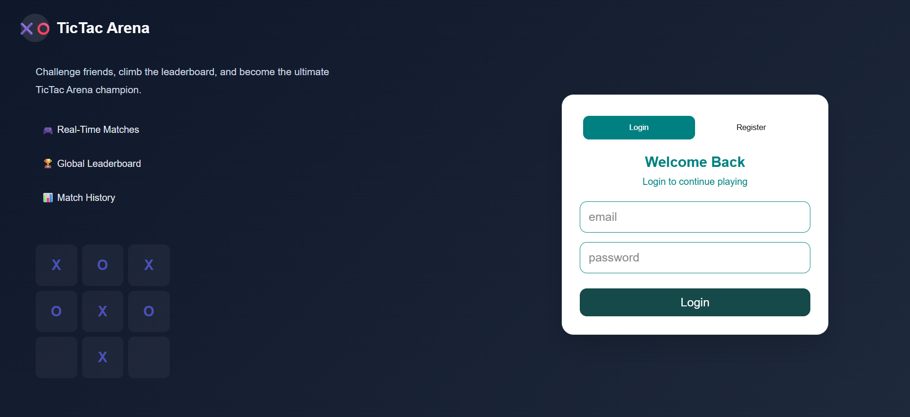
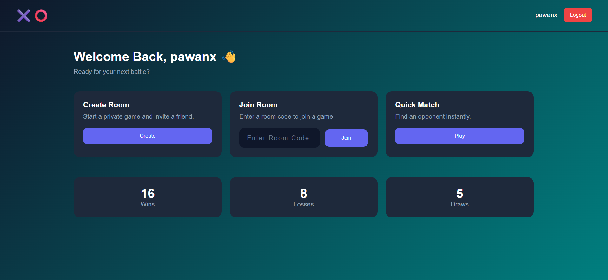
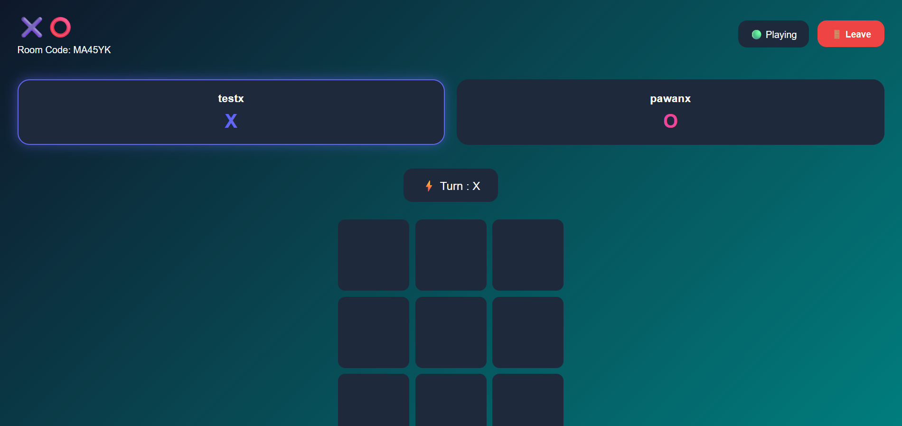

# 🎮 Tic Tac Arena

A real-time multiplayer Tic Tac Toe game built with the **MERN Stack** and **Socket.io**, featuring secure authentication, instant gameplay, and a responsive user interface.


---

## 🚀 Live Demo

🔗 **Frontend:** https://tik-tac-areana.vercel.app

🔗 **Backend:** https://tiktac-areana.onrender.com

---

## 📖 About

**Tic Tac Arena** is a real-time multiplayer Tic Tac Toe game where two authenticated players compete using a unique room code. The application uses **Socket.io** to synchronize moves instantly while maintaining game state on the server.

This project was built to strengthen my understanding of:

- Real-time communication
- WebSockets
- Multiplayer game architecture
- Authentication
- MERN Stack development

---

# ✨ Features

## 🔐 Authentication

- ✅ User Registration
- ✅ Login
- ✅ JWT Authentication
- ✅ Protected Routes
- ✅ Persistent Login

---

## 🎮 Multiplayer

- ✅ Create Game Room
- ✅ Join Existing Room
- ✅ Unique Room Code
- ✅ Waiting Room
- ✅ Real-time Gameplay
- ✅ Alternate Turns
- ✅ Winner Detection
- ✅ Draw Detection
- ✅ Invalid Move Prevention
- ✅ Server-side Game Validation

---

## 🎨 User Interface

- ✅ Responsive Design
- ✅ Modern Dashboard
- ✅ Interactive Game Board
- ✅ Loading States
- ✅ Error Handling

---

# 🛠 Tech Stack

## Frontend

- React
- React Router
- Context API
- Socket.io Client
- CSS3
- Vite

## Backend

- Node.js
- Express.js
- Socket.io
- MongoDB
- Mongoose
- JWT
- bcrypt

---

# 📂 Folder Structure

```text
tic-tac-arena
│
├── client
│   ├── src
│   │   ├── assets
│   │   ├── components
│   │   ├── context
│   │   ├── pages
│   │   ├── services
│   │   ├── socket
│   │   └── App.jsx
│   │
│   └── package.json
│
├── server
│   ├── config
│   ├── controllers
│   ├── middleware
│   ├── models
│   ├── routes
│   ├── socket
│   ├── utils
│   └── server.js
│
└── README.md
```

---

# 🔌 Socket Events

## Client → Server

```text
create-room
join-room
make-move
get-room
```

## Server → Client

```text
room-created
room-joined
room-error
room-data
game-updated
```

---

# 🎯 Game Flow

```text
Login/Register
      │
      ▼
 Dashboard
      │
 ┌───────────────┐
 │               │
 ▼               ▼
Create Room   Join Room
 │               │
 └───────┬───────┘
         ▼
 Second Player Joins
         ▼
 Real-Time Match
         ▼
 Winner / Draw
         ▼
 Leave Game
```

---

# 🔒 Security

- Passwords encrypted using bcrypt
- JWT Authentication
- Protected Routes
- Server-side Move Validation
- Turn Validation
- Room Validation

---

# 🚀 Installation

## Clone Repository

```bash
git clone https://github.com/yourusername/tic-tac-arena.git

cd tic-tac-arena
```

---

## Install Dependencies

### Client

```bash
cd client
npm install
```

### Server

```bash
cd server
npm install
```

---

# ⚙️ Environment Variables

Create a **.env** file inside the **server** folder.

```env
PORT=5000

MONGO_URI=your_mongodb_connection_string

JWT_SECRET=your_secret_key
```

---

# ▶️ Run Locally

### Start Backend

```bash
cd server

npm run dev
```

### Start Frontend

```bash
cd client

npm run dev
```

---

# 📸 Screenshots

## Login


---

## Dashboard


---

## Gameplay


---

# 🚧 Future Features

- Quick Gameplay
- Reconnect on internet loss or refresh
- AI Opponent

---

# 📚 What I Learned

Building this project helped me gain hands-on experience with:

- React Context API
- Socket.io
- WebSockets
- Real-time synchronization
- Multiplayer game architecture
- JWT Authentication
- Express.js
- MongoDB
- Responsive Design
- REST APIs

---

# 🤝 Contributing

Contributions are welcome.

Feel free to fork the repository, create a feature branch, and submit a pull request.

---

# 👨‍💻 Author

**Pawan Mishra**

### GitHub

https://github.com/pawanx

---

⭐ If you found this project useful, don't forget to **Star** the repository!